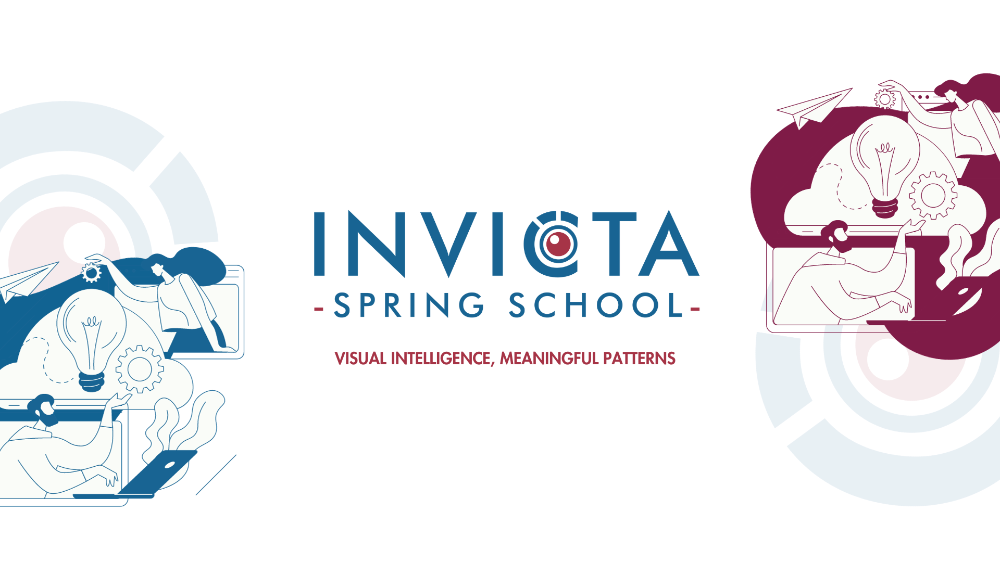

# INVICTA 2024

Hello and welcome to the official repository of the INVICTA Spring School 2024.

## Training Brain-Inspired Spiking Neural Networks Using Lessons from Deep Learning
Lecture by Jason Eshraghian - [Slides](brain-snn/slides/slides.pdf)

Hands-On by Jason Eshraghian - [Notebooks](brain-snn/notebooks)

GitHub by Jason Eshraghian - [GitHub](https://github.com/jeshraghian/invicta-spring-school)

## Continual Learning
Lecture by Gido van de Ven - [Slides](ContinualLearning/slides_SpringSchool_Mar2024.pdf)

Hands-On by Gido van de Ven - [Notebook](ContinualLearning/Hands_on_Tutorial_Continual_Learing.ipynb)

GitHub by Gido van de Ven - [GitHub](https://github.com/GMvandeVen)

## Causality for Machine Learning

Lecture by Julius von Kügelgen - [Slides](causal-ml/slides/slides.pdf)

Hands-On by Julius von Kügelgen - [Notebooks](causal-ml/notebooks/)

## Explainable AI
Lecture by Anna Hedström - [Slides]()

Hands-On by Anna Hedström - [Notebooks](xai/Quantus_x_INVICTA_Keynote_Series_%E2%80%94_Explainable_AI_Mon18.ipynb)

GitHub by Anna Hedström - [GitHub](https://github.com/annahedstroem)

## AI Talks
AI Talk by Kelwin Fernandes - [Slides](ai-talks/KelwinFernandes/slides.pdf)
